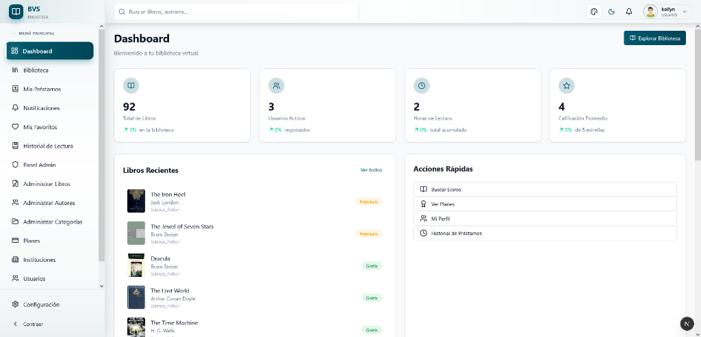
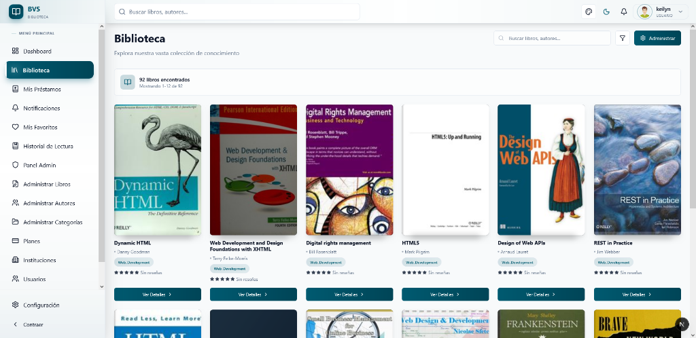
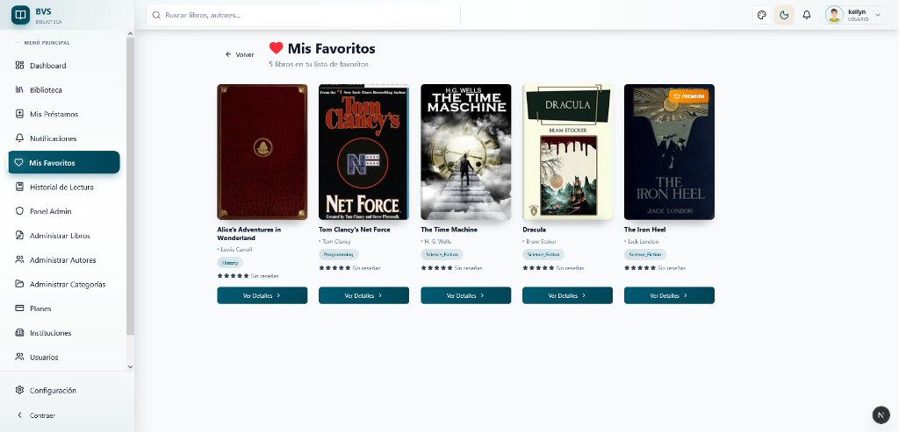

<div align="center">

# 📚 Biblioteca Virtual Renascer do Saber

### Plataforma moderna de biblioteca virtual con gestión integral de suscripciones, lectura y comunidad

<!-- Shields.io badges -->
[](https://opensource.org/licenses/MIT)
[](CHANGELOG.md)
[](CONTRIBUTING.md)
[](https://github.com/tu-usuario/bvs_framework/graphs/commit-activity)

<!-- Technology badges -->
[](https://www.python.org/downloads/)
[](https://www.djangoproject.com/)
[](https://nextjs.org/)
[](https://reactjs.org/)
[](https://www.typescriptlang.org/)
[](https://tailwindcss.com/)

<!-- Database & Infrastructure -->
[](https://www.postgresql.org/)
[](https://redis.io/)
[](https://www.docker.com/)

<!-- Quality & Testing -->
[](https://github.com/psf/black)
[](#-testing)
[](#-testing)

<!-- Build Status (uncomment when CI/CD is setup) -->
<!-- [](https://github.com/tu-usuario/bvs_framework/actions) -->
<!-- [](https://github.com/tu-usuario/bvs_framework/actions) -->
<!-- [](https://github.com/tu-usuario/bvs_framework/actions) -->

[Features](#-características-principales) • [Quick Start](#-quick-start) • [Documentación](#-documentación) • [Arquitectura](#-arquitectura) • [Contribuir](#-contribución)

</div>

---

## 📖 Índice

- [Acerca del Proyecto](#-acerca-del-proyecto)
- [Características Principales](#-características-principales)
- [Capturas de Pantalla](#-capturas-de-pantalla)
- [Quick Start](#-quick-start)
- [Stack Tecnológico](#-stack-tecnológico)
- [Arquitectura](#-arquitectura)
- [Instalación Completa](#-instalación-completa)
- [Configuración](#-configuración)
- [Uso](#-uso)
- [Scripts Disponibles](#-scripts-disponibles)
- [Testing](#-testing)
- [Roadmap](#-roadmap)
- [Documentación](#-documentación)
- [Contribución](#-contribución)
- [Licencia](#-licencia)

---

## 🎯 Acerca del Proyecto

**Biblioteca Virtual Renascer do Saber** es una plataforma integral para la gestión y lectura de libros digitales, diseñada para instituciones educativas y bibliotecas modernas. Combina un sistema robusto de gestión de contenido con una experiencia de lectura excepcional y características sociales que fomentan el engagement de los usuarios.

### ¿Por qué BVS Framework?

- ✅ **Completa**: Desde catálogo hasta lectura, suscripciones, préstamos y comunidades
- ✅ **Moderna**: Built with Next.js 16, React 19, Django 6 y tecnologías de vanguardia
- ✅ **Escalable**: Arquitectura preparada para miles de usuarios y millones de libros
- ✅ **Personalizable**: Temas, configuraciones y extensibilidad desde el código
- ✅ **Open Source**: Licencia MIT, comunidad activa

---

## ✨ Características Principales

### 🔐 Autenticación y Seguridad
- Sistema JWT con refresh tokens automáticos
- Registro y login seguros con validación
- Tipos de usuario: Estudiante, Empleado, Profesor, Bibliotecario, Moderador
- Soporte para autenticación 2FA (preparado)
- Rate limiting en endpoints críticos

### 📖 Gestión de Contenido
- **Catálogo Completo**: Miles de libros organizados por categorías y autores
- **Búsqueda Avanzada**: Powered by Meilisearch con autocompletado
- **Filtros Inteligentes**: Por categoría, autor, premium status
- **Importación Automática**: Integración con OpenLibrary API
- **Gestión de Archivos**: PDFs hasta 50MB, portadas hasta 5MB

### 📱 Lector PDF Avanzado
- Visor nativo en navegador sin plugins
- Control de zoom, navegación fluida
- **Bookmarks**: Marcadores con títulos y notas personales
- **Highlights**: Resaltado de texto con 5 colores disponibles
- **Anotaciones**: Notas asociadas a posiciones específicas
- Tracking automático de progreso y tiempo de lectura
- Privacidad configurable para anotaciones

### ⭐ Engagement de Usuario
- **Reseñas**: Calificaciones 1-5 estrellas con comentarios
- **Votación**: Sistema helpful/not helpful en reseñas
- **Favoritos**: Marca libros con notas personales
- **Historial de Lectura**: Estados (leyendo, completado, en pausa, abandonado)
- **Continuar Leyendo**: Widget inteligente de libros en progreso

### 💳 Suscripciones y Pagos
- Múltiples planes configurables (individual e institucional)
- Integración completa con Stripe
- Auto-renovación de suscripciones
- Webhooks para confirmación automática
- Panel de gestión de suscripciones

### 📚 Préstamos Físicos
- Gestión de ejemplares físicos con códigos de barras
- Estados de préstamo (activo, devuelto, vencido)
- Renovación automática (límite configurable)
- Cola de espera para libros no disponibles
- Cálculo de multas por retrasos
- Notificaciones cuando libro disponible

### 👥 Comunidades
- **Clubes de Lectura**: Públicos y privados
- **Roles**: Admin, Moderador, Miembro
- **Discusiones**: Hilos con pines y bloqueo
- **Publicaciones**: Sistema de posts con likes
- Enlace de discusiones a libros específicos

### 🔔 Sistema de Notificaciones
- 8 tipos de notificaciones (libro disponible, préstamo venciendo, nueva reseña, etc.)
- Centro de notificaciones unificado
- Envío opcional por email
- Metadata personalizable
- Marcado como leída con timestamp

### 🎨 Personalización de Temas
- **6 temas predefinidos**: Teal, Ocean Blue, Forest Green, Royal Purple, Sunset Orange, Rose Red
- **Modo oscuro/claro** toggleable
- Preview en vivo de colores
- Persistencia en localStorage
- Aplicación instantánea en toda la app

### 📲 Progressive Web App (PWA)
- Instalación en dispositivos móviles y escritorio
- Funcionalidad offline
- Shortcuts: Mi Biblioteca, Mis Préstamos
- Manifest completo con iconos optimizados
- Service Worker con caching strategy

### 📣 Marketing y Landing Pages
- **Landing Page Rediseñada**: Hero section dinámico con efectos parallax y optimización de visualización.
- **Páginas Públicas**: Secciones completas de "Acerca de", "Precios" y "Contacto".
- **UX Optimizada**: Botón "Back to Top" inteligente y navegación fluida orientada a la conversión.
- **Accesibilidad**: Componentes validados bajo normas WCAG 2.1 para alto contraste y legibilidad.

### 🚀 Performance
- Cache strategy optimizada
- Query optimization con annotations en Django
- Compresión gzip
- Image optimization con Next.js
- Turbopack en desarrollo
- Lazy loading de componentes
- Skeleton loaders
- Paginación eficiente

---

## 📸 Capturas de Pantalla

### 🌐 Homepage (Landing Page)

<div align="center">


*Nueva página de inicio con hero dinámico, parallax y diseño optimizado*

</div>

### 🏠 Dashboard Principal

<div align="center">



*Vista principal del dashboard con estadísticas de lectura y actividad reciente*

</div>

### 📚 Catálogo de Libros

<div align="center">



*Catálogo completo con búsqueda avanzada y filtros por categoría*

</div>

### 📖 Lector PDF con Anotaciones

<div align="center">


*Lector PDF con sistema completo de bookmarks, highlights y anotaciones*

</div>

### ⭐ Favoritos e Historial

<div align="center">



*Gestión de libros favoritos con notas personales*

</div>

### 💳 Planes de Suscripción

<div align="center">


*Selección de planes con integración de Stripe para pagos*

</div>

### 🎨 Personalizador de Temas

<div align="center">


*6 temas predefinidos con modo oscuro/claro y preview en vivo*

</div>

### 👥 Clubes de Lectura

<div align="center">


*Comunidades de lectura con discusiones y roles de miembro*

</div>

### 📱 Responsive Design

<div align="center">


*Diseño completamente responsive optimizado para dispositivos móviles*

</div>

> **Nota**: Los screenshots se agregarán en futuras actualizaciones. Mientras tanto, puedes iniciar la aplicación localmente para explorar todas las características.
>
> **Guía para contribuir screenshots**: Ver [docs/images/README.md](docs/images/README.md)

---

## 🚀 Quick Start

Pon en marcha el proyecto en menos de 5 minutos:

### Prerequisitos
- [Docker](https://www.docker.com/get-started) y Docker Compose
- Git

### Instalación Rápida

```bash
# 1. Clonar el repositorio
git clone https://github.com/tu-usuario/bvs_framework.git
cd bvs_framework

# 2. Copiar variables de entorno
cp .env.example .env

# 3. Iniciar con Docker
./scripts/docker/start_containers.sh  # Linux/Mac/WSL
# o
scripts\docker\start_containers.ps1   # Windows PowerShell

# 4. Acceder a la aplicación
# Frontend: http://localhost:3000
# Backend API: http://localhost:8000/api
# Admin Panel: http://localhost:8000/admin
```

### Crear Usuario Administrador

```bash
# Dentro del contenedor backend
docker exec -it bvs-backend python manage.py createsuperuser
```

### Importar Libros de Prueba

```bash
# Importar desde OpenLibrary
docker exec -it bvs-backend python manage.py import_openlibrary --query "python programming" --limit 50
```

¡Listo! 🎉 Ya tienes la biblioteca virtual funcionando.

---

## 🛠️ Stack Tecnológico

### Backend
| Tecnología | Versión | Propósito |
|-----------|---------|-----------|
| Python | 3.13 | Lenguaje base |
| Django | 6.0.1 | Framework web |
| Django REST Framework | 3.14.0 | API REST |
| PostgreSQL | 16 | Base de datos principal |
| Meilisearch | 0.31 | Motor de búsqueda |
| Redis | 7 | Cache y sessions |
| Celery | 5.3 | Tareas asíncronas |
| Stripe | 7.0 | Procesamiento de pagos |
| JWT | - | Autenticación |

### Frontend
| Tecnología | Versión | Propósito |
|-----------|---------|-----------|
| Node.js | 22 | Runtime |
| Next.js | 16.1.4 | Framework React |
| React | 19.2.3 | UI Library |
| TypeScript | 5.9.3 | Type safety |
| TailwindCSS | 4 | Estilos |
| Radix UI | - | Componentes accesibles |
| Zustand | 5.0.9 | Estado global |
| React Hook Form | 7.69.0 | Formularios |
| Zod | 4.2.1 | Validación |
| Axios | 1.13.2 | HTTP Client |
| Jest | 30.2.0 | Unit testing |
| Playwright | 1.57.0 | E2E testing |

### DevOps
- **Containerización**: Docker + Docker Compose
- **CI/CD**: GitHub Actions (planificado)
- **Monitoreo**: Sentry
- **Web Server**: Nginx
- **SSL**: Let's Encrypt / Self-signed (desarrollo)

---

## 🏗️ Arquitectura

### Diagrama de Alto Nivel

```
┌─────────────────────────────────────────────────────────────┐
│                         Frontend (Next.js 16)                │
│  ┌──────────┐  ┌──────────┐  ┌──────────┐  ┌──────────┐   │
│  │   Auth   │  │  Reader  │  │  Library │  │  Clubs   │   │
│  └──────────┘  └──────────┘  └──────────┘  └──────────┘   │
│  ┌──────────┐  ┌──────────┐  ┌──────────┐  ┌──────────┐   │
│  │ Favorites│  │ History  │  │  Plans   │  │ Settings │   │
│  └──────────┘  └──────────┘  └──────────┘  └──────────┘   │
└─────────────────────────────────────────────────────────────┘
                              │
                              │ REST API (HTTP/HTTPS)
                              │
┌─────────────────────────────────────────────────────────────┐
│                      Backend (Django 6)                      │
│  ┌───────────┐ ┌───────────┐ ┌───────────┐ ┌───────────┐  │
│  │   Auth    │ │  Content  │ │Subscrip.  │ │  Payments │  │
│  └───────────┘ └───────────┘ └───────────┘ └───────────┘  │
│  ┌───────────┐ ┌───────────┐ ┌───────────┐ ┌───────────┐  │
│  │   Loans   │ │Communities│ │Notifications│ │   Core    │  │
│  └───────────┘ └───────────┘ └───────────┘ └───────────┘  │
└─────────────────────────────────────────────────────────────┘
                              │
            ┌─────────────────┼─────────────────┐
            │                 │                 │
    ┌───────▼───────┐ ┌───────▼───────┐ ┌──────▼──────┐
    │  PostgreSQL   │ │  Meilisearch  │ │    Redis    │
    │      16       │ │      0.31     │ │      7      │
    └───────────────┘ └───────────────┘ └─────────────┘
```

### Estructura Backend

```
backend/
├── apps/
│   ├── authentication/      # JWT auth, user management
│   ├── content/            # Books, authors, categories, reviews
│   ├── subscriptions/      # Plans, user/institution subscriptions
│   ├── payments/           # Stripe integration, transactions
│   ├── loans/              # Physical book lending system
│   ├── communities/        # Reading clubs, discussions
│   ├── notifications/      # Notification system
│   ├── institutions/       # Institution management
│   └── core/               # Shared utilities, health checks
├── config/
│   ├── settings.py         # Django settings
│   └── urls.py             # URL routing
└── manage.py
```

### Estructura Frontend

```
frontend/src/
├── app/
│   ├── (auth)/             # Login, Register
│   ├── (marketing)/        # Public pages (Home, About, Pricing, Contact)
│   └── (dashboard)/        # Protected routes
│       ├── home/           # Dashboard
│       ├── library/        # Book catalog
│       ├── reader/         # PDF viewer
│       ├── favorites/      # Favorite books
│       ├── reading-history/ # Reading tracking
│       ├── my-loans/       # Loan management
│       ├── clubs/          # Reading clubs
│       ├── notifications/  # Notification center
│       ├── plans/          # Subscription plans
│       ├── checkout/       # Stripe checkout
│       ├── profile/        # User profile
│       └── settings/       # Theme customization
├── components/
│   ├── ui/                 # Base components (shadcn/ui)
│   ├── reader/             # PDF reader components
│   ├── subscriptions/      # Subscription components
│   ├── loans/              # Loan components
│   └── [feature-components]
├── hooks/                  # Custom React hooks
├── store/                  # Zustand stores
├── services/               # API services
├── lib/                    # Utilities
└── types/                  # TypeScript types
```

---

## 📦 Instalación Completa

### Opción 1: Con Docker (Recomendado)

#### Prerequisitos
- Docker 20.10+
- Docker Compose 2.0+

#### Pasos

```bash
# 1. Clonar repositorio
git clone https://github.com/tu-usuario/bvs_framework.git
cd bvs_framework

# 2. Copiar variables de entorno
cp .env.example .env
# Editar .env con tus configuraciones

# 3. Iniciar contenedores
./scripts/docker/start_containers.sh  # Linux/Mac/WSL
# o
scripts\docker\start_containers.ps1   # Windows PowerShell

# 4. Ejecutar migraciones
docker exec -it bvs-backend python manage.py migrate

# 5. Crear superusuario
docker exec -it bvs-backend python manage.py createsuperuser

# 6. Importar datos de prueba (opcional)
docker exec -it bvs-backend python manage.py import_openlibrary --query "programming" --limit 50
```

#### Con SSL/HTTPS (Opcional)

Para desarrollo local con certificados auto-firmados:

```bash
./scripts/setup/setup-ssl.sh  # Linux/Mac/WSL
# o
scripts\setup\setup-ssl.bat   # Windows

# Acceso con HTTPS:
# Frontend: https://localhost
# Backend: https://localhost/api
# Admin: https://localhost/admin
```

### Opción 2: Instalación Local (Sin Docker)

#### Prerequisitos Backend
- Python 3.13+
- PostgreSQL 16+
- Meilisearch 0.31+
- Redis 7+

#### Prerequisitos Frontend
- Node.js 22+
- npm 10+

#### Backend Setup

```bash
# 1. Navegar al backend
cd backend

# 2. Crear entorno virtual
python -m venv .venv

# 3. Activar entorno virtual
# Windows
.venv\Scripts\activate
# Linux/Mac
source .venv/bin/activate

# 4. Instalar dependencias
pip install -r requirements.txt

# 5. Configurar variables de entorno
cp .env.example .env
# Editar .env con tus configuraciones

# 6. Ejecutar migraciones
python manage.py migrate

# 7. Crear superusuario
python manage.py createsuperuser

# 8. Iniciar servidor
python manage.py runserver
```

#### Frontend Setup

```bash
# 1. Navegar al frontend
cd frontend

# 2. Instalar dependencias
npm install

# 3. Configurar variables de entorno
cp .env.example .env.local
# Editar .env.local con tu configuración

# 4. Iniciar servidor de desarrollo
npm run dev
```

---

## ⚙️ Configuración

### Variables de Entorno Backend

Crea un archivo `.env` en la raíz del proyecto:

```env
# Django
DJANGO_ENV=development
SECRET_KEY=your-secret-key-here-change-in-production
DEBUG=True
ALLOWED_HOSTS=localhost,127.0.0.1

# Database
DB_NAME=biblioteca_db
DB_USER=postgres
DB_PASSWORD=your-secure-password
DB_HOST=localhost
DB_PORT=5432

# Redis
REDIS_URL=redis://localhost:6379/0

# Meilisearch
MEILISEARCH_HOST=http://localhost:7700
MEILISEARCH_API_KEY=your-meilisearch-key

# CORS
CORS_ALLOWED_ORIGINS=http://localhost:3000,https://localhost

# Stripe
STRIPE_SECRET_KEY=sk_test_...
STRIPE_PUBLISHABLE_KEY=pk_test_...
STRIPE_WEBHOOK_SECRET=whsec_...

# Email (opcional)
EMAIL_HOST=smtp.gmail.com
EMAIL_PORT=587
EMAIL_USE_TLS=True
EMAIL_HOST_USER=your-email@gmail.com
EMAIL_HOST_PASSWORD=your-app-password

# JWT
JWT_ACCESS_TOKEN_LIFETIME=60  # minutos
JWT_REFRESH_TOKEN_LIFETIME=1440  # minutos (24 horas)

# File Upload
MAX_UPLOAD_SIZE=52428800  # 50MB en bytes
```

### Variables de Entorno Frontend

Crea un archivo `.env.local` en `frontend/`:

```env
# API Configuration
NEXT_PUBLIC_API_URL=http://localhost:8000/api

# Stripe
NEXT_PUBLIC_STRIPE_PUBLISHABLE_KEY=pk_test_...

# App Configuration
NEXT_PUBLIC_APP_NAME=Biblioteca Virtual
NEXT_PUBLIC_APP_URL=http://localhost:3000

# Features Flags (opcional)
NEXT_PUBLIC_ENABLE_PWA=true
NEXT_PUBLIC_ENABLE_OFFLINE=true
```

---

## 💻 Uso

### Acceder a la Aplicación

Una vez iniciado el proyecto:

- **Frontend**: http://localhost:3000
- **Backend API**: http://localhost:8000/api
- **Admin Panel**: http://localhost:8000/admin
- **API Docs** (Swagger): http://localhost:8000/api/docs/
- **Meilisearch Dashboard**: http://localhost:7700

### Credenciales Iniciales

Usa el superusuario creado durante la instalación para acceder al panel de administración.

### Flujo de Usuario

1. **Registro**: Crea una cuenta en `/register`
2. **Login**: Inicia sesión en `/login`
3. **Explorar**: Navega el catálogo en `/library`
4. **Leer**: Abre un libro en el lector `/reader/[bookId]`
5. **Suscribirse**: Selecciona un plan en `/plans` y completa el pago
6. **Participar**: Únete a clubes en `/clubs`

### API Endpoints Principales

#### Autenticación
```
POST /api/auth/login/              # Login con JWT
POST /api/auth/register/           # Registro de usuario
POST /api/auth/refresh/            # Refresh token
GET  /api/auth/user/               # Obtener perfil
PUT  /api/auth/user/update/        # Actualizar perfil
```

#### Contenido
```
GET  /api/content/books/                    # Listar libros
GET  /api/content/books/{slug}/             # Detalle del libro
GET  /api/content/books/{slug}/reviews/     # Reseñas del libro
POST /api/content/books/{slug}/reviews/     # Crear reseña
GET  /api/content/user/favorites/           # Favoritos del usuario
POST /api/content/user/favorites/{book_id}/ # Toggle favorito
GET  /api/content/user/reading-history/     # Historial de lectura
GET  /api/content/search/                   # Búsqueda avanzada
```

#### Suscripciones y Pagos
```
GET  /api/subscriptions/plans/         # Listar planes
GET  /api/subscriptions/subscription/  # Suscripción actual
POST /api/payments/checkout/           # Crear checkout
POST /api/payments/webhook/            # Webhook de Stripe
```

**Ver [docs/api/](docs/api/) para documentación completa de la API.**

---

## 📝 Scripts Disponibles

El proyecto incluye scripts automatizados en la carpeta `scripts/`:

### Docker

```bash
# Iniciar contenedores
./scripts/docker/start_containers.sh    # Linux/Mac/WSL
scripts\docker\start_containers.ps1     # Windows

# Verificar estado de Docker
./scripts/docker/check_docker.sh

# Detener contenedores
docker compose down
```

### Mantenimiento

```bash
# Crear superusuario
./scripts/maintenance/crear-superusuario.sh

# Importar libros desde OpenLibrary
./scripts/maintenance/importar-libros-custom.sh

# Backup de base de datos
./scripts/maintenance/backup-db.sh
```

### Utilidades

```bash
# Diagnóstico completo del sistema
./scripts/utils/diagnostico-completo.sh

# Verificar acceso a servicios
./scripts/utils/verificar-acceso.sh
```

### Comandos Django

```bash
# Backend
cd backend

# Migraciones
python manage.py makemigrations
python manage.py migrate

# Shell interactivo
python manage.py shell

# Tests
python manage.py test

# Importar libros
python manage.py import_openlibrary --query "python" --limit 50

# Reconstruir índice de búsqueda
python manage.py rebuild_search_index
```

### Comandos Frontend

```bash
# Frontend
cd frontend

# Desarrollo
npm run dev

# Build de producción
npm run build
npm run start

# Tests
npm run test              # Modo watch
npm run test:ci           # CI mode
npm run test:coverage     # Con coverage

# E2E Tests
npm run test:e2e          # Headless
npm run test:e2e:ui       # UI mode
npm run test:e2e:headed   # Headed mode
```

**Ver [scripts/README.md](scripts/README.md) para la lista completa de scripts.**

---

## 🧪 Testing

### Backend Testing

```bash
cd backend

# Ejecutar todos los tests
python manage.py test

# Test de una app específica
python manage.py test apps.authentication

# Con coverage
coverage run --source='.' manage.py test
coverage report
coverage html  # Genera reporte HTML en htmlcov/
```

### Frontend Testing

```bash
cd frontend

# Unit Tests (Jest + React Testing Library)
npm run test              # Modo watch
npm run test:ci           # Single run para CI
npm run test:coverage     # Con reporte de coverage

# E2E Tests (Playwright)
npm run test:e2e          # Headless
npm run test:e2e:ui       # Con UI de Playwright
npm run test:e2e:headed   # Modo headed
npm run test:e2e:debug    # Modo debug
```

### Coverage Objetivo

- **Backend**: 80%+ para lógica de negocio
- **Frontend**: 70%+ para componentes críticos
- **E2E**: Flujos principales de usuario

---

## 🗺️ Roadmap

### Estado Actual (Enero 2026)

#### ✅ Completado
- Sprint 0-5: Setup, Auth, Perfiles, Suscripciones, Búsqueda
- Sistema de Engagement (Reseñas, Favoritos, Historial)
- Lector PDF con anotaciones completas
- Préstamos físicos
- Clubes de lectura
- Sistema de notificaciones
- Personalización de temas (6 temas + modo oscuro)
- PWA completa

#### 🚧 En Progreso
- Mejoras de UX/UI
- Optimización de performance
- Más tests E2E

#### 📋 Próximos Sprints

**Sprint 11: Sistema de Recomendaciones** (Febrero 2026)
- Algoritmo de recomendaciones basado en:
  - Historial de lectura
  - Reseñas y calificaciones
  - Favoritos
  - Categorías preferidas
- Widget "Recomendado para ti"
- API de recomendaciones

**Sprint 12: Analytics y Reporting** (Marzo 2026)
- Dashboard de estadísticas avanzadas
- Reportes de lectura para usuarios
- Analytics para administradores
- Exportación de reportes (PDF, CSV)

**Sprint 13: Mejoras de Búsqueda** (Marzo 2026)
- Búsqueda por contenido dentro de PDFs
- Filtros avanzados adicionales
- Búsqueda por similitud
- Historial de búsquedas

**Sprint 14: Gamificación** (Abril 2026)
- Sistema de logros y badges
- Puntos por actividades
- Leaderboards
- Desafíos de lectura

**Sprint 15: Mobile App** (Mayo 2026)
- Aplicación nativa para iOS y Android
- Sincronización con web
- Descarga de libros para lectura offline

### Características Planeadas a Largo Plazo

- 🔔 Notificaciones push
- 🌐 Internacionalización (i18n)
- 📊 Machine Learning para recomendaciones avanzadas
- 🎙️ Audiolibros
- 📝 Soporte para ePub y otros formatos
- 🤝 Integración con bibliotecas externas
- 📱 App móvil nativa
- 🔍 OCR para digitalización de libros físicos

**Ver [docs/roadmap/](docs/roadmap/) para detalles completos.**

---

## 📚 Documentación

Toda la documentación está organizada en la carpeta `docs/`:

### Categorías

- **[🚀 Setup](docs/setup/)** - Guías de instalación y configuración
- **[📖 Guides](docs/guides/)** - Tutoriales y guías de uso
- **[🏗️ Architecture](docs/architecture/)** - Diseño y arquitectura técnica
- **[🔧 API](docs/api/)** - Documentación de endpoints
- **[🔍 Troubleshooting](docs/troubleshooting/)** - Solución de problemas
- **[📋 Sprint Docs](docs/sprint-docs/)** - Documentación de sprints

### Enlaces Rápidos

- **[📖 Índice de Documentación](docs/README.md)** - Punto de entrada
- **[🔧 Scripts Disponibles](scripts/README.md)** - Guía de scripts
- **[🤝 Guía de Contribución](CONTRIBUTING.md)** - Cómo contribuir
- **[🐳 Docker Setup](DOCKER-SETUP.md)** - Configuración de Docker
- **[📋 Planning de Sprints](docs/sprint-docs/)** - Planificación detallada

---

## 🤝 Contribución

Las contribuciones son bienvenidas y apreciadas. Por favor lee nuestra [Guía de Contribución](CONTRIBUTING.md) antes de empezar.

### Proceso de Contribución

1. **Fork** el repositorio
2. Crea una **rama** para tu feature (`git checkout -b feature/AmazingFeature`)
3. **Commit** tus cambios (`git commit -m 'Add some AmazingFeature'`)
4. **Push** a la rama (`git push origin feature/AmazingFeature`)
5. Abre un **Pull Request**

### Guías de Estilo

- **Python**: Seguir PEP 8
- **JavaScript/TypeScript**: Seguir ESLint config del proyecto
- **Commits**: Usar [Conventional Commits](https://www.conventionalcommits.org/)
- **Documentación**: Escribir en español, ser claro y conciso

### Reportar Bugs

Si encuentras un bug, por favor abre un issue con:
- Descripción detallada del problema
- Pasos para reproducir
- Comportamiento esperado vs actual
- Screenshots (si aplica)
- Información del ambiente (OS, versión de navegador, etc.)

### Solicitar Features

Para solicitar nuevas características:
- Abre un issue con la etiqueta `enhancement`
- Describe el problema que resuelve
- Propón una solución (opcional)
- Discute con la comunidad

---

## 📄 Licencia

Este proyecto está bajo la Licencia MIT. Ver el archivo [LICENSE](LICENSE) para más detalles.

```
MIT License

Copyright (c) 2025 Renascer do Saber

Permission is hereby granted, free of charge, to any person obtaining a copy
of this software and associated documentation files (the "Software"), to deal
in the Software without restriction...
```

---

## 👥 Equipo y Créditos

### Desarrollo
- **Arquitectura**: Basada en mejores prácticas de Django REST Framework y Next.js
- **Desarrollo**: Claude AI + Equipo Renascer do Saber
- **Diseño UI**: TailAdmin + shadcn/ui + Radix UI

### Tecnologías de Terceros
- [Django](https://www.djangoproject.com/)
- [Next.js](https://nextjs.org/)
- [React](https://reactjs.org/)
- [TailwindCSS](https://tailwindcss.com/)
- [Stripe](https://stripe.com/)
- [Meilisearch](https://www.meilisearch.com/)

### Agradecimientos
- OpenLibrary por la API de libros
- shadcn/ui por los componentes
- Radix UI por componentes accesibles
- Comunidad open source

---

## 💬 Soporte

Para obtener ayuda:

- 📖 Lee la [Documentación](docs/README.md)
- 🐛 Abre un [Issue](https://github.com/tu-usuario/bvs_framework/issues)
- 💬 Participa en [Discussions](https://github.com/tu-usuario/bvs_framework/discussions)
- 📧 Contacta al equipo: [email@example.com](mailto:email@example.com)

---

## 🌟 Apoya el Proyecto

Si este proyecto te resulta útil:

- ⭐ Dale una estrella en GitHub
- 🐛 Reporta bugs
- 💡 Sugiere features
- 🤝 Contribuye con código
- 📖 Mejora la documentación
- 🗣️ Comparte con otros

---

<div align="center">

**Desarrollado con ❤️ para la comunidad de Renascer do Saber**

[⬆ Volver arriba](#-biblioteca-virtual-renascer-do-saber)

</div>
