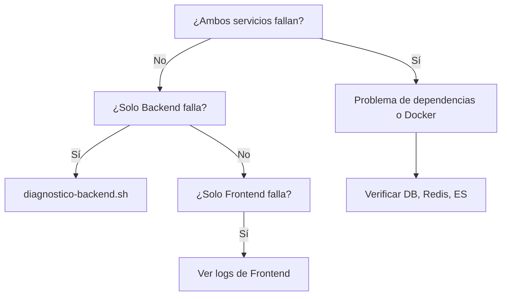

# 📘 Guía de Troubleshooting - Contenedores Docker

## 📋 Índice

1. [Problemas Comunes](#problemas-comunes)
2. [Metodología de Diagnóstico](#metodología-de-diagnóstico)
3. [Scripts de Solución](#scripts-de-solución)
4. [Casos de Uso Específicos](#casos-de-uso-específicos)
5. [Mejores Prácticas](#mejores-prácticas)

---

## 🎯 Problemas Comunes

### Problema 1: Contenedores UP pero Servicios NO Responden

**Síntomas:**
- `docker ps` muestra contenedores con estado "Up"
- No puedes acceder a frontend (puerto 3000)
- No puedes acceder a backend (puerto 8000)
- Timeout o "No se puede acceder al sitio" en navegador

**Causas Principales:**
1. **Servicio dentro del contenedor falló** - El proceso (Django/Node) no arrancó
2. **Healthcheck fallando** - Docker marca el contenedor como "unhealthy"
3. **Dependencias no listas** - DB, Redis, Elasticsearch no están disponibles
4. **Puerto no escuchando** - El servicio arrancó pero no está escuchando en el puerto correcto
5. **Error en código** - Bug que impide el inicio del servidor

**Solución Rápida:**
```bash
bash solucion-rapida.sh
```

**Solución Manual:**
```bash
# 1. Verificar estado
bash verificar-acceso.sh

# 2. Si backend falla - diagnosticar
bash diagnostico-backend.sh

# 3. Aplicar fix
bash fix-servicios-completo.sh

# 4. Si persiste - reset
bash reset-completo.sh
```

---

### Problema 2: Backend Responde pero Frontend No

**Síntomas:**
- `http://localhost:8000/admin/` funciona
- `http://localhost:3000` no carga o timeout

**Causas Principales:**
1. Next.js no compiló correctamente
2. Error en código React/TypeScript
3. Dependencias faltantes en node_modules
4. Puerto 3000 ocupado por otro proceso

**Diagnóstico:**
```bash
# Ver logs del frontend
docker-compose logs frontend --tail 50

# Ver si el puerto está escuchando
docker exec bvs_framework-frontend-1 netstat -tln | grep 3000
```

**Solución:**
```bash
# Reiniciar frontend
docker-compose restart frontend

# Si persiste, recrear
docker-compose up -d --force-recreate frontend

# Ver logs en tiempo real
docker-compose logs -f frontend
```

---

### Problema 3: Frontend Responde pero Backend No

**Síntomas:**
- `http://localhost:3000` carga pero muestra errores
- `http://localhost:8000/admin/` no responde
- Errores "Network Error" o "ERR_NETWORK" en consola del navegador

**Causas Principales:**
1. Django no arrancó (error en manage.py)
2. Error de conexión a PostgreSQL
3. Migraciones pendientes
4. Error en código Python

**Diagnóstico:**
```bash
bash diagnostico-backend.sh
```

**Solución:**
```bash
# Verificar logs
docker-compose logs backend --tail 50

# Verificar conexión a DB
docker exec bvs_framework-backend-1 python -c "import psycopg2; conn = psycopg2.connect(host='db', database='biblioteca', user='postgres', password='postgres'); print('OK')"

# Aplicar migraciones
docker-compose exec backend python manage.py migrate

# Reiniciar backend
docker-compose restart backend
```

---

### Problema 4: Healthcheck "Unhealthy"

**Síntomas:**
- `docker ps` muestra "(unhealthy)" en el estado
- Contenedor se reinicia constantemente

**Diagnóstico:**
```bash
# Ver configuración de healthcheck
docker inspect bvs_framework-backend-1 --format='{{json .State.Health}}' | jq

# Ver logs de healthcheck
docker inspect bvs_framework-backend-1 --format='{{range .State.Health.Log}}{{.Output}}{{end}}'
```

**Solución:**
```bash
# El healthcheck está definido en docker-compose.yml:
# Backend: curl -f http://localhost:8000/admin/
# Frontend: curl -f http://localhost:3000

# Si el servicio no responde en esas rutas, healthcheck falla

# Verificar manualmente
docker exec bvs_framework-backend-1 curl -f http://localhost:8000/admin/

# Solución: Asegurar que el servicio arranque correctamente
bash fix-servicios-completo.sh
```

---

### Problema 5: Puerto Ocupado

**Síntomas:**
- Error al iniciar: "port is already allocated"
- `docker ps` no muestra el contenedor

**Diagnóstico en Windows:**
```bash
# Ver qué está usando el puerto 3000
netstat -ano | findstr :3000

# Ver qué está usando el puerto 8000
netstat -ano | findstr :8000
```

**Diagnóstico en Linux/WSL:**
```bash
# Ver qué está usando el puerto
lsof -i :3000
lsof -i :8000

# O con netstat
netstat -tlnp | grep :3000
```

**Solución:**
```bash
# Opción 1: Matar el proceso que ocupa el puerto (Windows)
# Obtén el PID del comando anterior y ejecuta:
taskkill /PID <PID> /F

# Opción 2: Matar el proceso (Linux/WSL)
kill -9 <PID>

# Opción 3: Cambiar el puerto en docker-compose.yml
# Edita: ports: - "3001:3000" (usa 3001 en lugar de 3000)
```

---

## 🔍 Metodología de Diagnóstico

### Paso 1: Verificación Inicial

```bash
# 1. Verificar que Docker está corriendo
docker --version
docker ps

# 2. Verificar estado de contenedores
docker-compose ps

# 3. Verificar acceso a servicios
bash verificar-acceso.sh
```

### Paso 2: Identificar el Componente Problemático



**Comandos:**
```bash
# Verificar todos los servicios
docker-compose ps

# Identificar servicios "unhealthy" o "Exited"
docker ps -a --filter "status=exited"

# Ver servicios con problemas de salud
docker ps --filter "health=unhealthy"
```

### Paso 3: Revisar Logs

```bash
# Logs generales
docker-compose logs

# Logs específicos (últimas 50 líneas)
docker-compose logs backend --tail 50
docker-compose logs frontend --tail 50

# Logs en tiempo real
docker-compose logs -f backend frontend

# Logs de todos los servicios
bash diagnostico-puertos.sh > diagnostico-completo.txt
```

### Paso 4: Verificar Procesos Internos

```bash
# Verificar procesos dentro del contenedor backend
docker exec bvs_framework-backend-1 ps aux

# Verificar procesos Python/Django
docker exec bvs_framework-backend-1 ps aux | grep python

# Verificar procesos Node
docker exec bvs_framework-frontend-1 ps aux | grep node

# Verificar puertos escuchando
docker exec bvs_framework-backend-1 netstat -tln | grep 8000
docker exec bvs_framework-frontend-1 netstat -tln | grep 3000
```

### Paso 5: Verificar Conectividad

```bash
# Test de puertos desde el host
bash -c "echo >/dev/tcp/localhost/3000" && echo "Puerto 3000 abierto"
bash -c "echo >/dev/tcp/localhost/8000" && echo "Puerto 8000 abierto"

# Test HTTP desde el host
curl -I http://localhost:3000
curl -I http://localhost:8000/admin/

# Test desde dentro del contenedor
docker exec bvs_framework-backend-1 curl -I http://localhost:8000/admin/
docker exec bvs_framework-frontend-1 curl -I http://localhost:3000
```

### Paso 6: Aplicar Solución

```bash
# Solución automática
bash solucion-rapida.sh

# O manual según el problema identificado
# Ver sección "Scripts de Solución" abajo
```

---

## 🛠️ Scripts de Solución

### Script Maestro

**solucion-rapida.sh**
- Uso: Solución completa automática
- Cuándo: Primera opción, siempre
- Qué hace: Verifica → Aplica fix → Re-verifica → Muestra resultado

```bash
bash solucion-rapida.sh
```

---

### Scripts de Diagnóstico

**verificar-acceso.sh**
- Uso: Verificación sin modificar nada
- Cuándo: Para ver estado actual
- Qué hace: Test de puertos, HTTP, health status, logs resumidos

```bash
bash verificar-acceso.sh
```

**diagnostico-puertos.sh**
- Uso: Diagnóstico completo de ambos servicios
- Cuándo: Para entender qué falla
- Qué hace: Estado completo, logs extensos, procesos internos, recomendaciones

```bash
bash diagnostico-puertos.sh
```

**diagnostico-backend.sh**
- Uso: Diagnóstico específico del backend
- Cuándo: Cuando solo el backend falla
- Qué hace: Python/Django, DB connection, migraciones, variables de entorno

```bash
bash diagnostico-backend.sh
```

---

### Scripts de Fix

**fix-servicios-completo.sh**
- Uso: Fix automático con espera inteligente
- Cuándo: Cuando sabes que hay problemas
- Qué hace: Detiene → Verifica deps → Inicia backend → Espera → Inicia frontend → Verifica

```bash
bash fix-servicios-completo.sh
```

**reset-completo.sh**
- Uso: Reset total del sistema
- Cuándo: Último recurso cuando nada funciona
- Qué hace: Down → Limpia → Rebuild → Migraciones → Up → Verifica
- ⚠️ NO elimina datos de DB

```bash
bash reset-completo.sh
```

---

### Script de Utilidad

**listar-scripts.sh**
- Uso: Ver todos los scripts disponibles
- Cuándo: Para recordar qué scripts existen

```bash
bash listar-scripts.sh
```

---

## 📖 Casos de Uso Específicos

### Caso 1: Después de Cambios en el Código

**Escenario:** Hiciste cambios en el código Python o JavaScript

**Solución:**
```bash
# 1. Reiniciar el servicio modificado
docker-compose restart backend  # Si cambiaste Python
docker-compose restart frontend # Si cambiaste JS/React

# 2. Si hay errores, ver logs
docker-compose logs -f backend
docker-compose logs -f frontend

# 3. Si es error de sintaxis, corregir y reiniciar
# 4. Si persiste, recrear contenedor
docker-compose up -d --force-recreate backend
```

---

### Caso 2: Después de Cambios en Dependencias

**Escenario:** Agregaste/actualizaste packages (requirements.txt o package.json)

**Solución:**
```bash
# Backend (requirements.txt cambió)
docker-compose build backend
docker-compose up -d backend

# Frontend (package.json cambió)
docker-compose build frontend
docker-compose up -d frontend

# O rebuild completo
bash reset-completo.sh
```

---

### Caso 3: Después de Cambios en docker-compose.yml

**Escenario:** Modificaste docker-compose.yml (puertos, variables, etc.)

**Solución:**
```bash
# Recrear servicios con nueva configuración
docker-compose up -d --force-recreate

# O específico
docker-compose up -d --force-recreate backend frontend
```

---

### Caso 4: Después de Reiniciar la PC

**Escenario:** Reiniciaste Windows y ahora nada funciona

**Solución:**
```bash
# 1. Asegurar que Docker Desktop está corriendo
# Buscar el ícono en la bandeja del sistema

# 2. Iniciar servicios
docker-compose up -d

# 3. Esperar ~30 segundos

# 4. Verificar
bash verificar-acceso.sh

# 5. Si hay problemas
bash solucion-rapida.sh
```

---

### Caso 5: Error "Migraciones Pendientes"

**Escenario:** Backend logs muestran "You have unapplied migrations"

**Solución:**
```bash
# Aplicar migraciones
docker-compose exec backend python manage.py migrate

# Ver migraciones
docker-compose exec backend python manage.py showmigrations

# Reiniciar backend
docker-compose restart backend
```

---

### Caso 6: Error de Conexión a Base de Datos

**Escenario:** "could not connect to server" o "connection refused"

**Solución:**
```bash
# 1. Verificar que PostgreSQL está corriendo
docker-compose ps db

# 2. Si está "Exited", iniciarlo
docker-compose up -d db

# 3. Esperar 10 segundos para que esté listo
sleep 10

# 4. Reiniciar backend
docker-compose restart backend

# 5. Test de conexión manual
docker exec bvs_framework-backend-1 python -c "import psycopg2; conn = psycopg2.connect(host='db', database='biblioteca', user='postgres', password='postgres'); print('✓ Conexión OK')"
```

---

## 💡 Mejores Prácticas

### Prevención de Problemas

1. **Antes de hacer cambios grandes:**
   ```bash
   # Crear backup de la configuración actual
   docker-compose ps > estado-antes.txt
   ```

2. **Después de cambios en código:**
   ```bash
   # Siempre verificar que arranque correctamente
   docker-compose logs -f backend  # Ctrl+C para salir
   ```

3. **Monitoreo regular:**
   ```bash
   # Ejecutar verificación periódica
   bash verificar-acceso.sh
   ```

4. **Mantener logs:**
   ```bash
   # Guardar logs si hay problemas
   docker-compose logs > logs-$(date +%Y%m%d-%H%M%S).txt
   ```

### Orden de Ejecución de Scripts

```
1. verificar-acceso.sh      → Para ver estado actual
2. solucion-rapida.sh       → Primera solución automática
3. diagnostico-puertos.sh   → Si necesitas entender el error
4. fix-servicios-completo.sh → Fix manual si quieres control
5. reset-completo.sh        → Último recurso
```

### Cuándo Usar Cada Script

| Script | Úsalo cuando... | No lo uses si... |
|--------|----------------|------------------|
| verificar-acceso.sh | Solo quieres ver el estado | Necesitas arreglarlo ya |
| solucion-rapida.sh | Quieres solución automática | Quieres control manual |
| diagnostico-puertos.sh | Necesitas entender el error | Ya sabes qué falla |
| diagnostico-backend.sh | Solo backend falla | Ambos servicios fallan |
| fix-servicios-completo.sh | Quieres control del proceso | Quieres algo más rápido |
| reset-completo.sh | Nada más funciona | Es un problema simple |

### Comandos Útiles Adicionales

```bash
# Ver uso de recursos
docker stats --no-stream

# Ver espacio usado por Docker
docker system df

# Limpiar recursos no usados (cuidado)
docker system prune

# Ver redes
docker network ls

# Ver volúmenes
docker volume ls

# Inspeccionar un contenedor
docker inspect bvs_framework-backend-1

# Entrar a un contenedor (shell interactivo)
docker exec -it bvs_framework-backend-1 bash

# Ver variables de entorno de un contenedor
docker exec bvs_framework-backend-1 env
```

---

## 📞 Checklist de Troubleshooting

Usa este checklist cuando tengas problemas:

- [ ] Docker Desktop está corriendo
- [ ] `docker ps` muestra contenedores
- [ ] Ejecuté `bash verificar-acceso.sh`
- [ ] Revisé logs: `docker-compose logs backend frontend`
- [ ] Verifiqué dependencias: `docker-compose ps db redis elasticsearch`
- [ ] Probé `bash solucion-rapida.sh`
- [ ] Si persiste, ejecuté `bash diagnostico-puertos.sh`
- [ ] Guardé los logs: `docker-compose logs > logs.txt`
- [ ] Como último recurso, probé `bash reset-completo.sh`

---

## 🔗 Referencias

- **Scripts creados:** `/d/bvs_framework/*.sh`
- **Documentación principal:** `SOLUCION_DEFINITIVA_README.md`
- **Inicio rápido:** `INICIO_RAPIDO.txt`
- **Análisis técnico:** `ANALISIS_PROBLEMA_PUERTOS.md`

---

## 📝 Notas Importantes

1. **Los scripts son seguros** - No eliminan datos de la base de datos
2. **Puedes ejecutarlos múltiples veces** - Son idempotentes
3. **Tienen espera inteligente** - No fallan por timeout
4. **Muestran mensajes claros** - Sabes qué está pasando
5. **Son reutilizables** - Funcionan para problemas similares en el futuro

---

**Última actualización:** 2026-01-03
**Versión:** 1.0
**Autor:** Claude (Anthropic)
